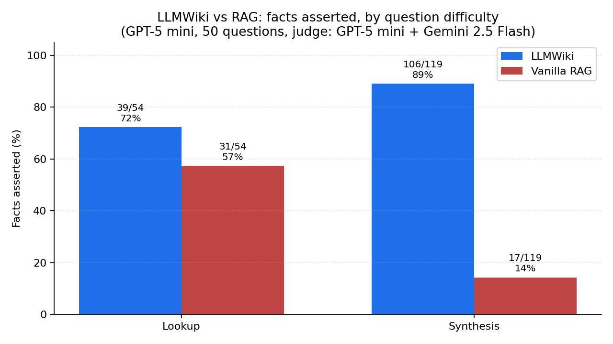
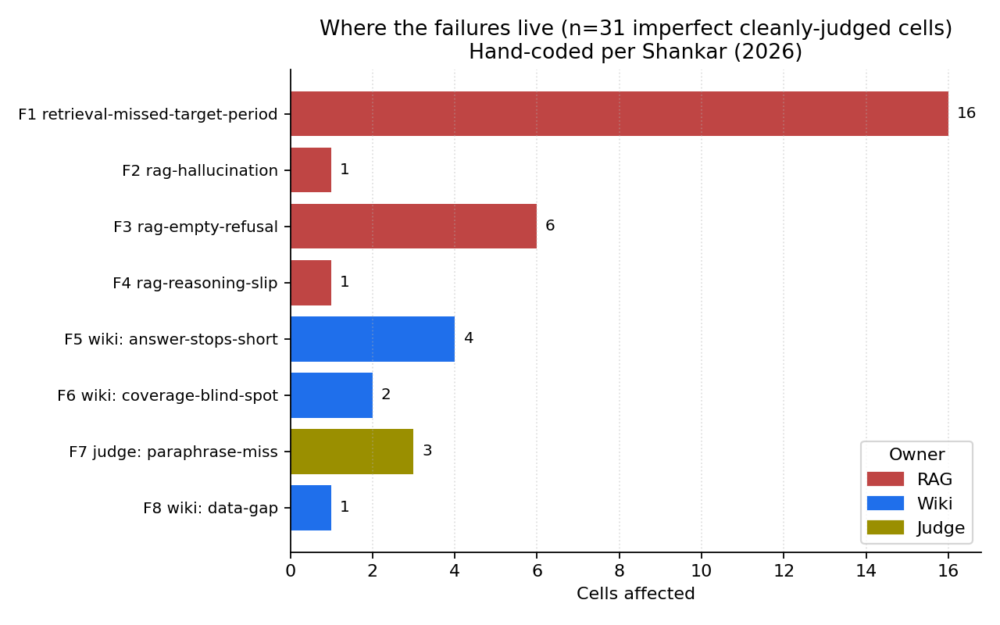

# LLMWiki vs RAG, on real corp-fin PDFs

A small experiment, run honestly, with the failures published.

> **Same model. Same 6 PDFs. Same questions.** Only the retrieval-and-synthesis strategy changes. The pre-compiled wiki crushes vanilla top-k RAG on cross-period synthesis questions — the kind people actually ask.

## Result

| Question type | Wiki agent | RAG baseline |
|---|---:|---:|
| **Lookup** (single-period facts) | **39/54 (72%)** | 31/54 (57%) |
| **Synthesis** (cross-period reasoning) | **106/119 (89%)** | 17/119 (14%) |
| **Aggregate** | **145/173 (84%)** | 48/173 (28%) |

GPT-5 mini answering both sides via OpenRouter. 50 hand-authored questions over 6 BCG Banking Sector Roundup PDFs (~300 pages, H1 FY25 → 9M FY26). LLM-as-judge: GPT-5 mini for the first 18 questions, Gemini 2.5 Flash for the rest (the original judge ran out of credits at q19; cells were re-graded with Gemini Flash via `eval/rejudge.py`). All 173 expected facts judged YES/NO; full results in `eval/runs/20260530-033125/results.jsonl`.



## What is each agent actually doing?

```
                Question
                   │
        ┌──────────┴──────────┐
        ▼                     ▼
  ┌──────────┐         ┌─────────────────┐
  │ wiki/*.md│         │ chunk 6 PDFs    │
  │ (24 KB)  │         │ → embed (MiniLM)│
  │ in       │         │ → top-8 nearest │
  │ system   │         │ to question     │
  │ prompt   │         │ → in prompt     │
  └────┬─────┘         └────────┬────────┘
       └──────► GPT-5 mini ◄─────┘
                   │
                Answer + cited source
```

- **Wiki agent** (`eval/agents/wiki_agent.py`): reads all of `wiki/*.md` (~24 KB, pre-synthesized cross-period tables and themes) into the system prompt. The 6 PDFs were ingested *once* by hand — that's the bet.
- **RAG baseline** (`eval/agents/rag_agent.py`): chunks the same 6 PDFs into 350-word windows (331 chunks), embeds with `sentence-transformers/all-MiniLM-L6-v2`, retrieves top 8 chunks per question. Standard playbook.

Both end with **the same model call**, same temperature, same answer-format instruction. The only thing that varies is *what context the model sees*.

## Why does RAG lose?

Hand-coded every wrong answer following Shankar's qualitative-analysis discipline (codes reused across cells, falsifiable categories, hard cases not skipped — see [`wiki/eval-failure-taxonomy.md`](wiki/eval-failure-taxonomy.md)).



**100% of RAG's failures are retrieval-driven** (F1 + F2 + F3 + F4). The model isn't dumb — the retriever just couldn't find the right page for cross-period questions. Sample failure (q5, *describe the CASA ratio trend across 6 periods*):

> *"I cannot provide period-by-period industry CASA ratio numbers — the provided passages do not contain industry CASA ratio values for H1 FY25, FY26, or 9M FY26."*

The figures **are in the PDF corpus.** Top-8 just didn't surface them for that query. The wiki agent had all six in a single pre-built table, so the question was a lookup.

**Half the wiki "failures" aren't wiki failures** (F5 `answer-stops-short`, F7 `judge-paraphrase-miss`). The agent gave correct headline answers but didn't volunteer secondary facts; or the judge marked NO when the answer asserted the fact in different words. Both are prompt/judge-side fixes, not corpus problems. **One genuine wiki gap** (F8): the FY25 industry NIM YoY decline (-11 bps) is in the raw notes but didn't make it into `wiki/banking-sector-roundup.md`.

## Reproduce

```bash
# 1. install (sentence-transformers pulls in torch; ~750 MB)
uv venv .venv --python 3.12
uv pip install --python .venv/bin/python -r eval/requirements.txt

# 2. add your OpenRouter key
cp .env.example .env
$EDITOR .env  # set OPENROUTER_API_KEY

# 3. run
.venv/bin/python eval/run.py --model gpt-5-mini

# Outputs:
#   eval/runs/<timestamp>/results.jsonl   (line per cell)
#   eval/runs/<timestamp>/summary.md      (aggregate + per-question)
```

The runner writes `results.jsonl` line-by-line and supports `--resume <run-id>` if it crashes mid-run. The judge model is configurable in `eval/judge.py`.

## Repo layout

```
raw/                       # immutable sources — read, never edit
  banking-sector-roundup-*.pdf
  banking-sector-roundup.md         (series notes + cross-period table)
  parsed/                            (Pulse-extracted markdown)
  shankar-qual-analysis.md, howtoeval.md, vals-ai.md, …
wiki/                      # LLM-maintained pages — the artifact
  banking-sector-roundup.md          (summary + table)
  indian-banking-fy25-fy26.md        (cross-period themes)
  eval-failure-taxonomy.md           (F1–F8 with cell citations)
  llm-evaluation.md, agent-runtimes.md, howtoeval.md, …
eval/                      # the harness
  golden/questions.jsonl             (50 hand-authored questions)
  agents/wiki_agent.py               (LLMWiki agent)
  agents/rag_agent.py                (RAG baseline)
  judge.py, run.py, rejudge.py, resummary.py
  runs/                              (per-run results + summaries)
scripts/
  parse_pdf.py                       (Pulse wrapper, pages → markdown)
  make_charts.py                     (regenerate the README charts)
docs/charts/               # PNGs used in this README
PITCH.md                   # v1 thesis
AGENTS.md                  # wiki schema (per Karpathy's gist)
log.md                     # append-only ingest/run log
index.md                   # catalog of raw/ and wiki/
```

## Honest caveats

- **One model, one corpus.** Replicating with Sonnet/Opus and a second domain (tax) is the next step before this generalizes.
- **Judge is fallible and split.** First 18 questions graded by GPT-5 mini; q19–q50 graded by Gemini 2.5 Flash (after the original judge ran out of credits). Gemini grades stricter on paraphrases — switching judges between cells is a real source of noise. F7 (judge-paraphrase-miss) is documented in the failure taxonomy.
- **The wiki was hand-built.** That's the experiment, not a product. A "wiki agent that maintains itself" (Karpathy's gist) is a separate question; this repo measures whether *having* a maintained wiki helps.
- **The RAG baseline is deliberately standard, not optimal.** No reranker, no query rewriting, no hybrid search. The point is "what does the textbook approach buy you," not "is RAG fundamentally broken."

## Background reading, in this repo

- [Karpathy's LLM-wiki gist](https://gist.github.com/karpathy/442a6bf555914893e9891c11519de94f) — the pattern this repo implements. Notes in `raw/karpathy-llm-wiki.md`.
- [Hylak, *How to Evaluate AI Agents*](https://www.howtoeval.com/) — golden cases, code-native harness, publish failures. `wiki/howtoeval.md`.
- [Shankar, *Agent-Assisted Qualitative Analysis*](https://www.sh-reya.com/blog/ai-qual-analysis/) — methodology for the failure-taxonomy page. `wiki/shankar-qual-analysis.md`.
- [Vals AI](https://www.vals.ai/) — independent benchmarking; CorpFin v2 / Finance Agent v2 are the natural next benchmarks. `wiki/vals-ai.md`.

## License

The harness, scripts, and wiki/raw markdown are MIT (see `LICENSE` if added).
The 6 BCG PDFs in `raw/` are © Boston Consulting Group; this repo redistributes them
verbatim from BCG's public publication. Substituting a different finance corpus is
straightforward — drop PDFs into `raw/` and re-run.
